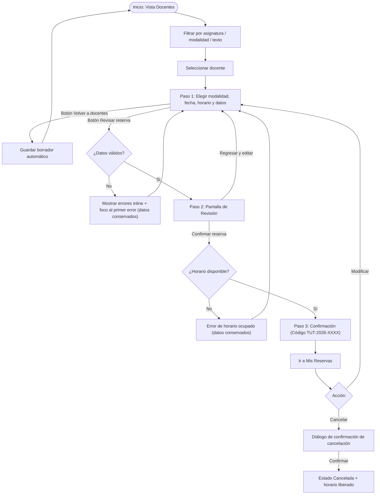

# User Flow — Camino Exitoso y Recuperación de Errores

```mermaid
flowchart TD
    Start(["Inicio: Vista Docentes"]) --> Filter["Filtrar por asignatura / modalidad / texto"]
    Filter --> SelectDoc["Seleccionar docente"]
    SelectDoc --> Form["Paso 1: Elegir modalidad, fecha, horario y datos"]
    Form -->|Botón Volver a docentes| SaveDraft["Guardar borrador automático"]
    SaveDraft --> Start
    Form -->|Botón Revisar reserva| Validate{"¿Datos válidos?"}
    Validate -->|No| ShowErr["Mostrar errores inline + foco al primer error (datos conservados)"]
    ShowErr --> Form
    Validate -->|Sí| Review["Paso 2: Pantalla de Revisión"]
    Review -->|Regresar y editar| Form
    Review -->|Confirmar reserva| CheckSlot{"¿Horario disponible?"}
    CheckSlot -->|No| SlotErr["Error de horario ocupado (datos conservados)"]
    SlotErr --> Form
    CheckSlot -->|Sí| Confirmed["Paso 3: Confirmación (Código TUT-2026-XXXX)"]
    Confirmed --> MyRes["Ir a Mis Reservas"]
    MyRes --> Action{"Acción"}
    Action -->|Modificar| Form
    Action -->|Cancelar| Modal["Diálogo de confirmación de cancelación"]
    Modal -->|Confirmar| Released["Estado Cancelada + horario liberado"]
```
