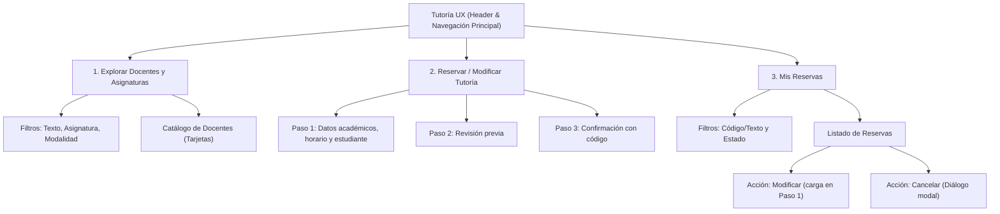

# Sitemap — Tutoría UX

```mermaid
flowchart TD
    Root["Tutoría UX (Header & Navegación Principal)"]
    Root --> V1["1. Explorar Docentes y Asignaturas"]
    Root --> V2["2. Reservar / Modificar Tutoría"]
    Root --> V3["3. Mis Reservas"]

    V1 --> V1A["Filtros: Texto, Asignatura, Modalidad"]
    V1 --> V1B["Catálogo de Docentes (Tarjetas)"]

    V2 --> V2A["Paso 1: Datos académicos, horario y estudiante"]
    V2 --> V2B["Paso 2: Revisión previa"]
    V2 --> V2C["Paso 3: Confirmación con código"]

    V3 --> V3A["Filtros: Código/Texto y Estado"]
    V3 --> V3B["Listado de Reservas"]
    V3B --> V3C["Acción: Modificar (carga en Paso 1)"]
    V3B --> V3D["Acción: Cancelar (Diálogo modal)"]
```
